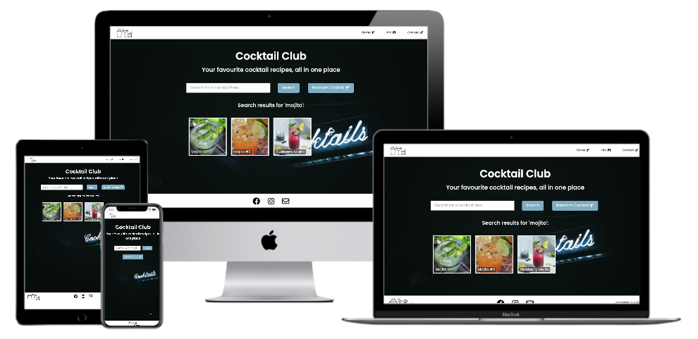

# **Cocktail Club**
### **Milestone project 2: Interactive Frontend Development - Code Institute**

A website that uses <a href="https://www.thecocktaildb.com/api.php" target="_blank">TheCocktailDB API</a> to search for cocktail recipes by name as well as the option for a random recipe.

## Demo
---------------
Live demo can be viewed <a href="https://fayskerritt.github.io/cocktailclub/" target="_blank">here</a>

## UX
---------------
* A simple layout provides ease of use to users from the homepage.
* The site is responsive across all screen sizes.
* Inputs use placeholders as well as error messages in place to clearly describe what needs to be entered by user.
* Light colours used on a dark background to make the content stand out and easy to read.

### **User Stories**
#### - First Time Visitor User Stories
* As a first time user, I want to understand the main purpose of the site to learn more about the site’s features.
* As a first time user, I want to easily navigate throughout the site to find content.

#### - Returning Visitor User Stories
* As a returning user, I want to search by cocktail name, so that I can find a cocktail recipe to make at home.
* As a returning user, I want to be given a random cocktail recipe, so that I can get inspiration for making cocktails at home.
* As a returning user, I want to learn tips and tricks for making cocktails at home, so that I can prepare what equipment I need for making cocktails at home.

#### - Frequent Visitor User Stories
* As a frequent user, I want to be able to request for a new recipe to be added to the site, so that I can find all my favourite recipes in one place.
* As a frequent user, I want to be able to find community links to social media so I can follow or view recent posts.

### **Design**
### Colour Scheme
* The colour scheme of the website was decided on so that it is eye-catching to the user but also easy to read with light text on a dark background. 

### Typography
* The font 'Poppins' was used because it is very easily read and is a modern font that looks nice.

### Imagery
* The background image used is very minimal so that it is not a distraction from the main content but still eyecatching and fits in with the colour scheme. 
* The recipe results are displayed in an easy to view grid, each with a photo and the cocktail name. Each recipe can then be expanded to view the whole recipe. In case the user is not happy with that specific recipe there is a back button to allow users to browse each recipe without having to reload the page.

### Wireframes
* Figma was used to design the wireframes for both mobile and desktop - <a href="https://www.figma.com/file/HC618UdxHcbhAvexrrO5Hp/Milestone-2-Wireframes" target="_blank">View</a>

## Features
---------------
* Use of <a href="https://www.thecocktaildb.com/api.php" target="_blank">TheCocktailDB</a> API to build a recipe search website using JavaScript and jQuery.
* Bootstrap grid system used in certain areas to ensure responsiveness on all screen sizes.
* Sticky/Fixed Navbar - gives user a sense of control and allows them to use the links to jump to any section on the site at any time.
* Collapsing Navbar - Navbar will collapse and replaced by a hamburger menu on smaller screens (below 768px) for a cleaner look.
* Recipe search functionality allows user to search the name of a cocktail and will display a grid of all matching recipes.
* Full recipe view showing the cocktail categories, instructions, method and glass to use.
* Random recipe generator - button to display a random cocktail recipe.
* Hide and show grid when viewing each recipe for ease of viewing with a 'Back' button to go back to the grid.
* Contact form to allow users to request new recipes for the site.

## Technologies used---------------
1. <a href="https://en.wikipedia.org/wiki/HTML5" target="_blank">HTML5</a> - to create content for website.
2. <a href="https://en.wikipedia.org/wiki/CSS" target="_blank">CSS3</a> - to style HTML content to look nice.
3. <a href="https://www.javascript.com/" target="_blank">JavaScript</a> - to call API calls to retrieve cocktail recipes.
4. <a href="https://jquery.com/" target="_blank">jQuery</a> - to simplify the JavaScript written in the project.
4. <a href="https://www.thecocktaildb.com/api.php" target="_blank">TheCocktailDB</a> API - to pull cocktail recipes to my site.
5. <a href="https://www.figma.com/file/HC618UdxHcbhAvexrrO5Hp/Milestone-2-Wireframes" target="_blank">Figma</a> - to create wireframes.
6. <a href="https://getbootstrap.com/" target="_blank">Bootstrap</a> - as a responsive template to personalise with own CSS.
7. <a href="https://github.com/fayskerritt/cocktailclub" target="_blank">GitHub</a> - used to store the project. 
8. <a href="https://git-scm.com/" target="_blank">Git</a> - used for version control by using the Gitpod terminal to add, commit and push the code to GitHub.
8. <a href="https://fonts.google.com/specimen/Poppins" target="_blank">Google Fonts</a> - used to import the "Poppins' font which is used across all pages of the site.

## Testing
---------------
The W3C Markup and CSS Validator services were used to check each page of the website to ensure no syntax errors. JSHint was also used to check the JavaScript:

#### HTML
* <a href="https://validator.w3.org/" target="_blank">W3C HTML Validator</a> to check the markup validity of the Web documents in HTML - No errors or warnings.

#### CSS
* <a href="https://jigsaw.w3.org/css-validator/" target="_blank">W3C CSS Validator</a> to check the markup validity of Web documents in CSS - No errors or warnings.

#### JavaScript
* <a href="https://jshint.com/" target="_blank">JSHint</a> was used to check the JavaScript on the site - No errors or warnings.

### Testing User Stories
#### - First Time Visitor User Stories
* As a first time user, I want to understand the main purpose of the site to learn more about the site's features.
	- Upon entering the site, users are greeted with a brief but to the point tag line that explains what you are able to do on the website.
	- The search bar has placeholder text to prompt the user to search for a cocktail, as well as a clearly labelled button to get a random cocktail recipe.

* As a first time user, I want to easily navigate throughout the site to find content.
	- Each page of the site has a clean navigation bar, each page link describes clearly where the user will end up.
	- The navigation bar will collapse on a smaller screen and display the hamburger icon which is a well known symbol for the navbar.
	- In the footer of each page there are clear links to social media platforms alongside a contact icon which links through to the contact page.
	- The contact page has an alert after the form has been submitted, the form refreshes and the inputs are cleared to make it clear that it was a success.

#### - Returning Visitor User Stories
* As a returning user, I want to search by cocktail name, so that I can find a cocktail recipe to make at home.
	- The search bar is centred to the home page with placeholder text to prompt to user of what to type in.
	- The ‘Search’ button is positioned to the right of the input bar to make it clear of its use.
	- When the ‘Search’ button is clicked a list of cocktail recipes is displayed below the search bar with a header that states *Search results for ‘users input’*.
	- Each of the cocktails in the list is clickable to reveal its full recipe including photo, categories, ingredients and method.
	- The cocktail recipe card has a ‘Back’ button which allows the user to navigate back to the list to view other recipes matching their search.

* As a returning user, I want to be given a random cocktail recipe, so that I can get inspiration for making cocktails at home.
	- The home page has a ‘Random Cocktail’ button which is centred to the page below the search feature, clearly marked.
	- Once clicked the ‘Random Cocktail’ button will display a full recipe card of a randomly picked cocktail.
	- The button can be clicked as many times as possible to allow the user as much choice as they need. 

* As a returning user, I want to learn tips and tricks for making cocktails at home, so that I can prepare what equipment I need for making cocktails at home.
	- The site includes an ‘Info’ page that gives the user information about making cocktails at home.
	- The info page includes images to help explain the tips.

#### - Frequent Visitor User Stories
* As a frequent user, I want to be able to request for a new recipe to be added to the site, so that I can find all my favourite recipes in one place.
	- The site includes a contact page which has a clear tagline and form for users to fill in to request new cocktails to be added to the site.
	- The form has placeholder text to ensure users are clear of what to type in each box.

* As a frequent user, I want to be able to find community links to social media so I can follow or view recent posts.
	- In the footer of each page there are social media icons that link to the relevant platform for users to click on to take them to a new tab in their browser.

### Further Testing
* The website was viewed on a mobile device (iPhone XS), a large desktop and a smaller Macbook desktop screen. 
* The website was tested on Google Chrome and Safari browsers.
* Different types of cocktail names were searched for, including ones that do not exist to see what happened. In the case that nothing was found JS was used to display an error message to say ‘No cocktails found, please try again!’, as well as an error message if the input was left blank.
* All page links and buttons were tested to ensure they are all working properly.
* Website was shared with friends and family to ensure it works correctly and to point out any issues.

### Known Bugs/Errors
* Certain cocktail recipes had incomplete data when it came to the measure, therefor I added in code to check whether the value was 'null' and if so to leave it blank.
* A random selection of cocktails was planned to be added to the homepage to fill the page a bit more, although to be able to use this feature of the API a subscription was needed with a monthly payment, therefor this was not implemented to the site.
* The 'click' functions did not work on an iPhone, meaning you were unable to click on the grid of cocktails. 'touchstart' was added to the JS, however this did not solve the issue. It would require a complete restructuring of the JS code which will be added into future developments of the site.

## Deployment
---------------
### GitHub Pages
This site is hosted on GitHub using GitHub pages, deployed directly from the master branch. The site will update automatically after any new commits from the master branch. 
So that the site deploys correctly the landing page has been named `index.html`.

The site was deployed to GitHub Pages using the following steps:
1. Log in to GitHub and go to the relevent repository
2. Go to 'Settings', which is the final tab across the top of the repository
3. Find the 'GitHub Pages' section and where it says 'Source' change the dropdown menu from 'None' to 'Master Branch'
4. This will automatically refresh the page and your published site link will show underneath the 'GitHub Pages' section

### Forking the GitHub Repository
Forking the GitHub repository makes a copy of the original repository on your GitHub account so that it can be viewed and changed without affecting the master branch.

The repository can be forked by using the following steps:
1. Log in to GitHub and go to the relevant repository
2. In the top right hand corner of the page click the 'Fork' button
3. This will create a copy of the mster branch for you to edit without affecting the original

### Making a Local Clone
You can clone your repository to create a local copy on your computer so that you can sync between the two locations.

The repository can be cloned by using the following steps:
1. Log in to GitHub and go to the relevant repository
2. Click on the '<kbd>↓</kbd> Code' button to display the dropdown options
3. Copy the link to clone the repository using HTTPS
4. Open Git Bash
5. Change the current directory to the location you want  the cloned directory to be made
6. Type `git clone` followed by the URL you copied from Step 3 which will look something like this `$ git clone https://github.com/fayskerritt/cocktailclub.git`
7. Press enter to create your local clone
For a more detailed explanation see the <a href="https://docs.github.com/en/free-pro-team@latest/github/creating-cloning-and-archiving-repositories/cloning-a-repository" target="_blank">GitHub Docs</a>

## Credits
---------------
### Code
* Media Queries for Responsive text came from <a href="https://www.w3schools.com/howto/howto_css_responsive_text.asp" target="_blank">W3schools.com</a>.
* The grid system used across the site came from <a href="https://getbootstrap.com/" target="_blank">Bootstrap4</a>.

### Content
* Inspiration was taken from the Code Institute projects included in the Interactive Frontend Development module.
* All content was written by myself.

### Media
* The image used for the background of the pages is from Unsplash and can be found <a href="https://unsplash.com/photos/FsYZE4ZZKJY" target="_blank">here</a>.
* The site logo is my own created on <a href="https://www.figma.com/file/4NBuK37DddKDj6bm6Q1BjD/Cocktail-Club-Logo-and-images?node-id=0%3A1" target="_blank">Figma</a> as well as the other line drawings on the Info page.

### Acknowledgements
* My mentor for their feedback throughout the project and frequent meetings.
* Tutor support from the Code Institute tutors.
